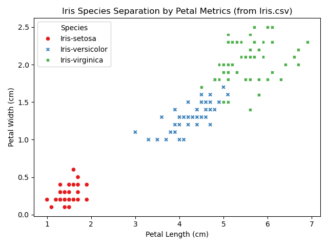
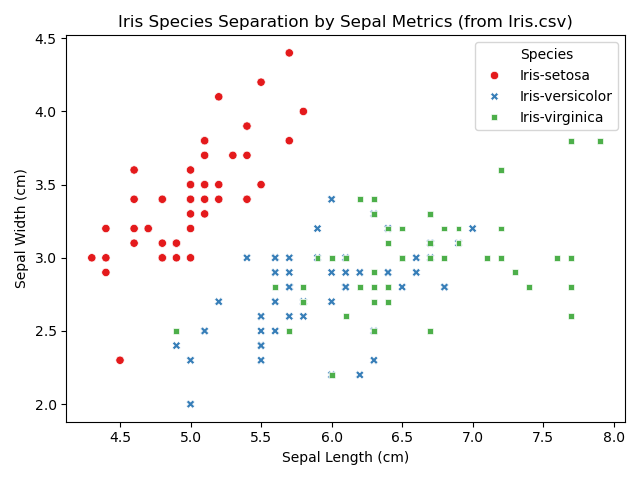

# Iris Species Classification using Support Vector Machines (SVM)

This project explores, visualizes, and classifies the classic **Iris Dataset** using a linear Support Vector Classifier (SVC). It processes raw data, handles exploration metrics, creates visual cluster distributions, and evaluates model performance using standard classification metrics.

---

## Project Structure
* `IRIS.py`: Main Python script containing the complete pipeline (Data loading, EDA, visualization, preprocessing, training, and evaluation).
* `iris_csv_petal_chart.png`: Scatter plot showcasing species separation based on petal measurements.
* `iris_csv_sepal_chart.png`: Scatter plot showcasing species separation based on sepal measurements.
* `cleaned_iris_from_csv.csv`: Processed dataset exported after dropping uninformative identification columns.

---

## Visual Data Insights

### 1. Petal Metrics Separation
As shown below, petal length and width provide an exceptional feature space for classification. **Iris-setosa** forms a completely distinct cluster, while **Iris-versicolor** and **Iris-virginica** show minimal boundary overlap.



### 2. Sepal Metrics Separation
Sepal characteristics present a more complex, overlapping distribution. While **Iris-setosa** remains fairly distinguishable due to its shorter length and wider profile, **Iris-versicolor** and **Iris-virginica** heavily intermix across these dimensions.



---

## Machine Learning Pipeline

### 1. Exploratory Data Analysis (EDA) & Data Cleaning
* Prints dataset structural summaries (`df.info()`).
* Verifies missing value counts to ensure data integrity.
* Calculates distribution balances across class labels (`Iris-setosa`, `Iris-versicolor`, `Iris-virginica`).
* Identifies and reports coordinate duplicate entries across features.
* Drops the uninformative `Id` column before feeding features to the model.

### 2. Training and Test Stratification
The data is split into **70% training** and **30% testing** sets. Stratified sampling (`stratify=y`) is enforced to ensure that both splits mirror the exact percentage proportions of each species found in the original source file.

### 3. Model Architecture
A **Support Vector Machine (SVM)** classifier initialized with a **linear kernel** (`kernel='linear'`) is fitted to the training set. A linear boundaries approach is ideal here given the highly clear separation demonstrated by the petal metrics.

---


## Evaluation Outputs
Upon running the pipeline, the system outputs comprehensive classification reports detailing performance:
* **Accuracy Score:** Overall prediction accuracy on the unseen test split.
* **Confusion Matrix:** Breakdown of true positives, false positives, and misclassifications across classes.
* **Classification Report:** Precision, recall, and F1-score computed dynamically for each independent species.

---

## Setup and Execution

### Prerequisites
Ensure your Python environment contains the necessary scientific packages. You can install them collectively via pip:
```bash
pip install pandas matplotlib seaborn scikit-learn
